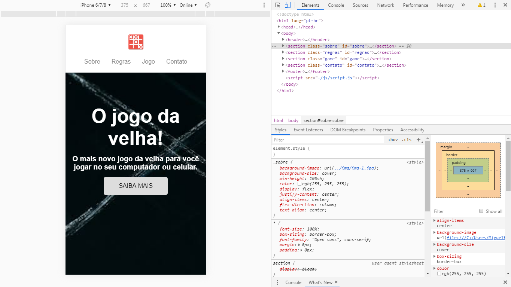

# Jogo da velha multi plataforma
 
Esse é um projeto pessoal, no qual eu desenvolvi um joguinho da forca, responsivo, ou seja funciona tanto no computador como nos smartphones e tablets, as tecnologias utilizadas foram apenas HTML5, CSS3 e JS, no qual para deixar responsivo eu utilizei flexbox que é próprio do CSS.

# Prints ilustrativos

Esta imagem representa o usuário ao abrir no computador

 
 

Esta imagem representa o usuário ao abrir no smartphone

